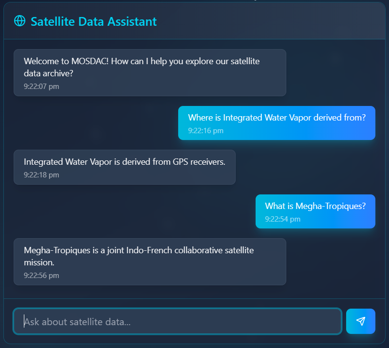
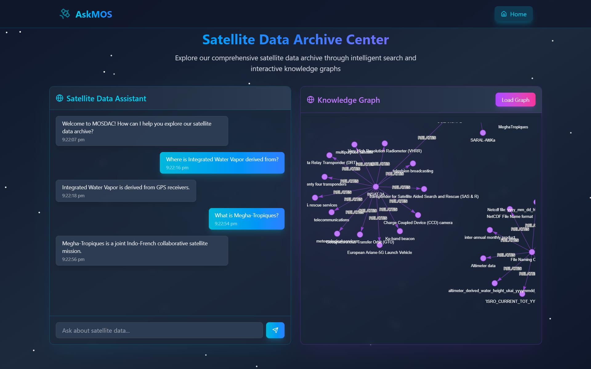

<p align="center">
  
</p>

**An intelligent, space-themed assistant that scrapes data from [MOSDAC](https://mosdac.gov.in/), builds a knowledge graph, and answers your queries with the power of LLMs and Neo4j.**

---

## 🌌 Project Description

**AskMOS** is a full-stack AI-powered data retrieval assistant for the [MOSDAC (Meteorological and Oceanographic Satellite Data Archival Centre)](https://mosdac.gov.in/) website. It combines web scraping, knowledge graph generation, and large language models to offer users an intuitive way to query space data and visualize its structure.

Users can interact with an intelligent chatbot to ask questions about the scraped content from MOSDAC, and get responses generated through a series of LangChain agents. These agents leverage LLMs to form queries, extract structured information, and communicate the results back in a natural language format. The generated knowledge graph is also rendered for users to explore visually through a sleek, responsive, and space-themed frontend.

---

## 🛠️ Tech Stack

### 👨‍💻 Languages
- Python
- JavaScript
- HTML, CSS

### ⚙️ Backend
- Flask
- LangChain, LangChain-Groq
- Neo4j (graph database)
- FAISS (semantic vector search)
- Groq (Meta LLaMA via API)
- SentenceTransformers (HuggingFace)
- Python-Dotenv
- Flask-CORS

### 📊 Data Processing & Visualization
- BeautifulSoup (bs4)
- Requests
- NetworkX
- Pyvis
- Matplotlib
- Plotly

### 🎨 Frontend
- React
- Tailwind CSS
- Vite

### 🧰 Tools
- Git
- Vercel (frontend hosting)
- Render (backend hosting)

---

## ✨ Features

- 🌐 **Query the MOSDAC website** using natural language
- 🧠 **AI-powered assistant** backed by Groq-hosted Meta LLaMA models via LangChain agents
- 🧵 **Dynamic knowledge graph** using Neo4j and Pyvis
- 🛰️ **Scraping & triplet extraction** from live site content
- 🔍 **Semantic search** on entities/relationships via FAISS vector store
- ⚡ **Responsive space-themed UI** built with React and Tailwind
- 🔄 **Automatic Cypher query generation** and answer summarization
- 🧠 **LLM-powered entity extraction and semantic fallback logic**

---

## 📸 Screenshots

### 🧠 AI Chat Interface


---

### 🌐 Knowledge Graph Visualization


---

### 💫 Home Page - Space Theme


---

## 🧱 Architecture Overview


1. **Scraper**: BeautifulSoup collects data from MOSDAC.
2. **Triplet Extractor**: Groq-hosted Meta LLaMA extracts `(subject, predicate, object)` triplets.
3. **Graph Storage**: Triplets are stored in a Neo4j database.
4. **Vector Store**: All entities and relationships are embedded and stored in FAISS for semantic search.
5. **Query Engine**:
   - LangChain agent turns user questions into Cypher queries.
   - Another agent interprets the results and generates natural responses.
6. **Visualization**: The knowledge graph is rendered using Pyvis and NetworkX.
7. **Frontend**: The React app provides a sleek, space-themed UI.

---

## 📁 Project Structure

```
├── backend/
│ ├── backend.py
│ ├── backend_with_faiss.py
│ └── .env.example
├── data/
│ └── *.py # Web scraping and triplet extraction
│ └── .env.example
├── frontend/
│ └── isro-hackathon/ # React + Tailwind frontend
├── assets/
│ └── logo.png # Project logo
├── screenshots/
│ └── *.png # UI screenshots
├── faiss_index/
│ ├── index.faiss
│ └── index.pkl
├── requirements.txt
└── README.md
```

---

## 🧩 Environment Setup

Wherever required, `.env.example` files are provided to guide your configuration. Just rename them to `.env` and insert your values.

---

## 🚀 Installation & Running

### 1. Clone the repository
```bash
git clone https://github.com/yourusername/AskMOS.git
cd AskMOS
```

### 2. Setup Python backend
```bash
cd backend
python -m venv venv
source venv/bin/activate  # or `venv\Scripts\activate` on Windows
pip install -r requirements.txt

# Run the updated backend
python backend_with_faiss.py
```

### 3. Setup React frontend
```bash
cd ../frontend/isro-hackathon
npm install
npm run dev
```
Now your frontend will run at http://localhost:5173 and the Flask backend at http://localhost:5000.
