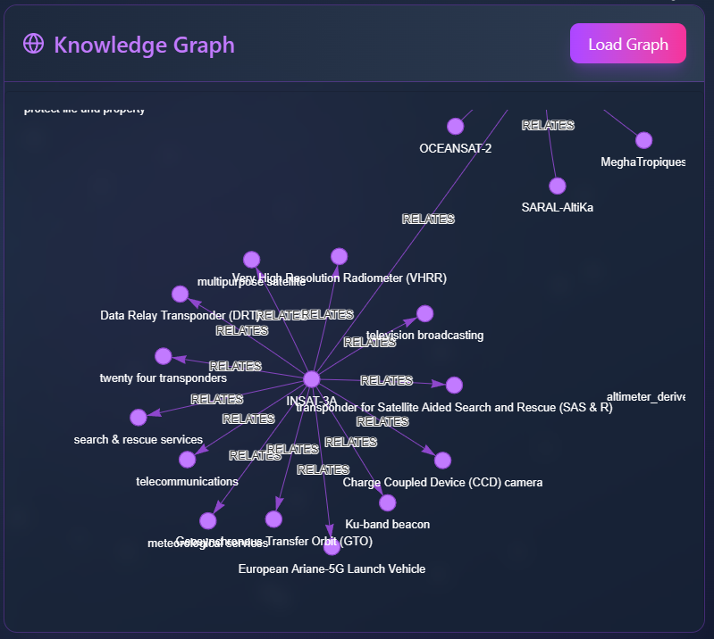

# 🚀 AskMOS

**An intelligent, space-themed assistant that scrapes data from [MOSDAC](https://mosdac.gov.in/), builds a knowledge graph, and answers your queries with the power of LLMs and Neo4j.**

---

## 🌌 Project Description

**AskMOS** is a full-stack AI-powered data retrieval assistant for the [MOSDAC (Meteorological and Oceanographic Satellite Data Archival Centre)](https://mosdac.gov.in/) website. It combines web scraping, knowledge graph generation, and large language models to offer users an intuitive way to query space data and visualize its structure.

Users can interact with an intelligent chatbot to ask questions about the scraped content from MOSDAC, and get responses generated through a series of LangChain agents. These agents leverage LLMs to form queries, extract structured information, and communicate the results back in a natural language format. The generated knowledge graph is also rendered for users to explore visually through a sleek, responsive, and space-themed frontend.

---

## 🛠️ Tech Stack

### 👨‍💻 Languages
- Python
- JavaScript
- HTML, CSS

### ⚙️ Backend
- Flask
- Streamlit (for local graph visualization)
- LangChain, LangChain-Groq
- Neo4j
- Groq (Meta LLaMA via API)
- Tiktoken, HuggingFace Transformers
- Python-Dotenv

### 📊 Data Processing & Visualization
- BeautifulSoup (bs4)
- Requests
- NetworkX
- Pyvis
- Matplotlib
- Plotly

### 🎨 Frontend
- React
- Tailwind CSS
- Vite

### 🧰 Tools
- Git
- Vite

---

## ✨ Features

- 🌐 **Query the MOSDAC website** using natural language
- 🧠 **AI-powered assistant** backed by Groq-hosted Meta LLaMA models via LangChain agents
- 🧵 **Dynamic knowledge graph** visualization using Neo4j and Pyvis
- 🛰️ **Scraping & triplet extraction** from live site content
- ⚡ **Responsive space-themed UI** built with React and Tailwind
- 🔍 **Automatic Cypher query generation** and interpretation
- 🔄 Real-time agent interaction and answer generation pipeline

---

## 📸 Screenshots

### 🧠 AI Chat Interface


---

### 🌐 Knowledge Graph Visualization


---

### 💫 Home Page - Space Theme


---

## 🧱 Architecture Overview

1. **Scraper**: BeautifulSoup collects data from MOSDAC.
2. **Triplet Extractor**: Groq-hosted Meta LLaMA model extracts `(subject, predicate, object)` triplets.
3. **Graph Storage**: Triplets are stored in a Neo4j graph database.
4. **Query Engine**:
   - LangChain agent turns user question into a Cypher query.
   - Another agent interprets the Cypher query result and generates a response.
5. **Visualization**: The knowledge graph is visualized and rendered for the user.
6. **Frontend**: The React app serves a clean, interactive, and themed UI.

---

## 📁 Project Structure

```
├── backend/
│ └── backend.py # Flask API backend
├── data/
│ └── *.py # Web scraping and triplet generation scripts
├── frontend/
│ └── isro-hackathon/ # React + Tailwind frontend
├── .env.example # Example environment variables
├── README.md # This file
```

---

## 🧩 Environment Setup

Wherever required, `.env.example` files are provided to guide your configuration. Just rename them to `.env` and insert your values.

---

## 🚀 Installation & Running

### 1. Clone the repository
```bash
git clone https://github.com/yourusername/AskMOS.git
cd AskMOS
```

### 2. Setup Python backend
```bash
cd backend
python -m venv venv
source venv/bin/activate  # or `venv\Scripts\activate` on Windows
pip install -r requirements.txt
```

### 3. Setup React frontend
```bash
cd ../frontend/isro-hackathon
npm install
npm run dev
```
Now your frontend will run at http://localhost:5173 and the Flask backend at http://localhost:5000.
